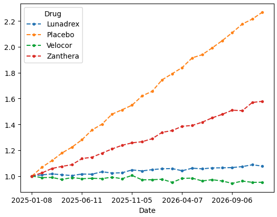

## Dask DataFrames for Large Tabular Data  
### Session 3: 1:00 – 1:30 PM

---

## Refresher: What is a Pandas DataFrame?

- A **Pandas DataFrame** is a 2D, in-memory table of labeled, heterogeneous data.
- It's built on top of NumPy and designed for **fast, interactive data analysis**.
- Ideal for small to medium datasets that **fit entirely in RAM**.
- Provides rich functionality: filtering, joining, grouping, reshaping, time series support, etc.
<br><br>
```python
import pandas as pd

df = pd.read_csv("data.csv") # e.g. sklearn breast_cancer dataset...

df.head()
```


---

## What is a Dask DataFrame?

- A **Dask DataFrame** is a parallel, out-of-core version of a Pandas DataFrame.
- It supports many familiar Pandas operations: `groupby`, `filter`, `join`, etc.
- Operations are **lazy**, building a task graph for optimized execution.
<br><br>
```python
import dask.dataframe as dd

df = dd.read_csv("data/large_dataset_*.csv")
```
<br><br>

## Why Not Use Pandas?

- **Single-threaded**: Pandas operates on one core — no automatic parallelism.
- **In-memory only**: Entire dataset must fit in RAM.
- **Eager execution**: Each line runs immediately, limiting optimization opportunities.
- **Limited scalability**: Great for small data, but struggles with "big-enough" data.

---

## How Dask DataFrames Work

- A **Dask DataFrame** is made of many smaller Pandas DataFrames called **partitions**.
- Operations are applied **independently** to each partition.
- Instead of executing immediately, Dask builds a **task graph** and delays execution until `.compute()` is called.
- This enables **parallel**, **out-of-core**, and **optimized execution**.
<br><br>

<table><tbody><td>

```python
# Nothing runs yet — this is lazy
result = df[df.score > 0.9].groupby("region")["value"].mean()

# Now the computation happens
result.compute()
```

</td><td>


</td></tbody></table>

---

## Reading Data with Dask DataFrame

- In Pandas you would `read_csv` one file:

```python
import pandas as pd

df = pd.read_csv("./longitudinal_data/2025-07-08.csv")
```

- In Dask, you can similarly `dd.read_csv()` to lazily load one or many files with a wildcard `*`.

```python
import dask.dataframe as dd

# Read multiple CSVs with wildcard
df = dd.read_csv("./longitudinal_data/2025-*.csv")
```

- Files are **not read into memory immediately** — just metadata is loaded.
- You can also read **Parquet**, **JSON**, and data from **S3, GCS**, etc.

- Running this may yield a `RuntimeError`:

```console
ImportError: Missing optional dependency 'pyarrow'.  Use pip or conda to install pyarrow.
```

- Dask reads data in **blocks** across partitions using **file-access backends**, like `pyarrow`. Pip install it!

---

## Inspecting Partitions in Dask DataFrames

- When you load multiple files with Dask splits the dataset into **partitions**.
- Each partition is just a **Pandas DataFrame**, held separately in memory or read lazily from disk.

<table><tbody><td>

 ```python
df.npartitions  # We used "2025-*.csv" as our wildcard, so n = 12 chunks
 ```

</td>
<td>

```console
12
```

</td></tbody></table>

<table><tbody><td>

 ```python
# you can access the partitions individually
print(df.partitions[0])
 ```

</td>
<td>

```console
Dask DataFrame Structure:
                 Date     ID    Name TumorDiameter_cm    Drug
npartitions=1                                                
               string  int64  string          float64  string
                  ...    ...     ...              ...     ...
Dask Name: partitions, 3 expressions
Expr=Partitions(frame=ArrowStringConversion(
    frame=FromMapProjectable(7d94751)), 
    partitions=[0])
```

</td></tbody></table>

- Note that partitions are just lazy expressions referencing each file: **must call `df.partitions[0].compute()`!**

---

## Lazy Execution: Nothing Happens Until `.compute()`

- Dask DataFrames don’t load or compute data immediately.
- Operations build a **task graph** — a deferred plan, not actual results.
- You can slice a partition, filter rows, or chain operations — all of it stays lazy until `.compute()`.
```python
df = dd.read_csv("./longitudinal_data/2025-*.csv")          # No files read yet

df_filtered = df[df.Drug == "Placebo"]
print(type(df_filtered)) # Still lazy
# OUTPUT: <class 'dask.dataframe.dask_expr._collection.DataFrame'>

df_computed = df_filtered.compute()    # Now Dask loads and computes
print(type(df_computed))
# OUTPUT: <class 'pandas.core.frame.DataFrame'> We're back to Pandas!

print(df_computed.head())
```

```console
          Date    ID       Name  TumorDiameter_cm     Drug
3   2025-01-08  1618     Elijah             0.396  Placebo
4   2025-01-08   663      James             0.180  Placebo
12  2025-01-08  1927      Ethan             0.519  Placebo
18  2025-01-08   161  Sebastian             0.319  Placebo
19  2025-01-08   291      Mateo             0.247  Placebo
```

---

## Filtering, Grouping, and Aggregating

- Dask supports many familiar Pandas operations — but they remain **lazy** until `.compute()` is called.
- Example: Filter the dataset, group by drug, and calculate the mean tumor diameter.

```python
# Load and filter patients
df = dd.read_csv("./longitudinal_data/2025-*.csv")
filtered = df[df.TumorDiameter_cm > 0.3]

# Group and aggregate
summary = filtered.groupby("Drug")["TumorDiameter_cm"].mean()

# Trigger the computation
summary.compute()
```

```console
Drug
Lunadrex    0.412
Placebo     0.489
Velocor     0.317
Zanthera    0.371
Name: TumorDiameter_cm, dtype: float64
```

---

## Applying Functions to Partitions (mapping)

- Use `df.map_partitions()` to apply a custom function to each partition (a Pandas DataFrame).
- Great for:
  - Row-wise operations not built into Dask
  - Applying Pandas logic in parallel
  - Custom formatting or filtering

```python
def double_tumor(df):
    df["Tumor_x2"] = df["TumorDiameter_cm"] * 2
    return df

new_df = df.map_partitions(double_tumor)

new_df.head()
```

```console
         Date    ID    Name  TumorDiameter_cm      Drug  Tumor_x2
0  2025-01-08  1409    Liam             0.290  Lunadrex     0.580
1  2025-01-08   328    Noah             0.579  Lunadrex     1.158
2  2025-01-08   151  Oliver             0.470  Lunadrex     0.940
3  2025-01-08  1618  Elijah             0.396   Placebo     0.792
4  2025-01-08   663   James             0.180   Placebo     0.360
```

---

## Example: Plotting Tumor Diameter over all Patients

- Let's use Dask DataFrame to plot average tumor progression over time spread over many files.
- We want to **group**, **mean**, **normalize** and **plot**: 
    - **What can Dask do? What can it _NOT_ do?**

<table><tbody><td>

 ```python
df = dd.read_csv("./longitudinal_data/202*.csv") # load data

# Dask Operations
monthly_growth_task = (
    df.groupby(["Date", "Drug"])["TumorDiameter_cm"]
    .mean()
    .reset_index()
)

# Run the tasks! Spit out Pandas
monthly_growth = monthly_growth_task.compute()

# Pandas Operations: things that Dask can't handle!
monthly_growth = monthly_growth.pivot(
    index="Date", columns="Drug", values="TumorDiameter_cm"
    )
monthly_growth = monthly_growth / monthly_growth.iloc[0] # normalize

monthly_growth.plot(marker='.', linestyle='--') # built-in plot
 ```

</td>
<td>

<center>TumorDiameter_cm</center>


</td></tbody></table>

---

## Why not cram everything before `.compute()`?

### Dask DataFrames can't parallelize tasks that require **Global Context**!
___

### Why `.pivot()` doesn't work:
- Pivoting needs to **know all unique values** in the pivot column (e.g. `"Drug"`).
- But those values could be spread across different files/partitions.
- Dask **can’t collect those values** without first reading all the data.
<br><br>
### Why normalization by first month doesn't work:
- `.iloc[0]` only makes sense when the full DataFrame is in memory.
- Dask has no concept of “first row overall” across all partitions.
<br><br>
### So what can we do?
- Let Dask do **Grouping**, **Averaging**, and **Index Resets** in parallel.
- Then use Pandas for global, in-memory logic like **Normalizing**, **Pivoting**

---

## Summary: Dask DataFrames

- Dask lets you work with **big tabular data** using familiar Pandas-like code.

- It operates **lazily**, building a task graph — nothing runs until you `.compute()`.

- Data is split into **partitions**, enabling parallelism and out-of-core processing.

- **Partitions** under the hood are just Pandas `DataFrames`.

- **Careful!** Some global operations (like `.pivot()`, plotting, `.iloc[]`) cannot be parallelized. **Use Pandas!**


